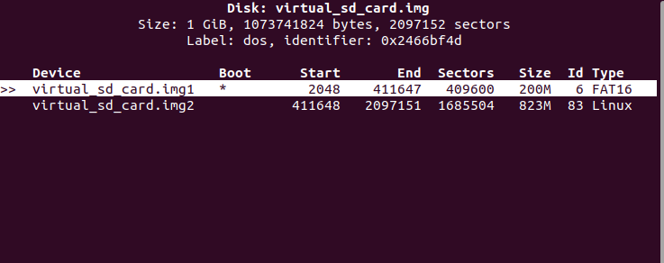

<div align="center">
   <h1>Virtual SD Card for Embedded Linux Development</h1>
</div>

---

### Step-by-Step Guide
1. **Create a Disk Image**
    - Use the `dd` command to create a disk image file that will serve as your virtual SD card.
    - Example (1GB image):
       ```bash
       dd if=/dev/zero of=virtual_sd_card.img bs=1M count=1024
       ```
    <div align="center">
       
    </div>

2. **Formatting and Partitioning**
    - Use `cfdisk` to partition the disk image into two partitions:
       ```bash
       cfdisk virtual_sd_card.img
       ```
    - In the `cfdisk` interface:
       - Select Label Type `dos` for MPR.
       - Create a new partition for the Raspi bootloader (e.g., 200MB, primary, 6.FAT16, Bootable).
       - Create another partition for the root filesystem (e.g., 800MB, primary, 83 Linux Type ext4).
    <div align="center">
       
    </div>

3. **Attach the Disk Image**
    - Use the `losetup` command to attach the disk image to a loop device:
       ```bash
       sudo losetup -fP virtual_sd_card.img
       ```
       - `-f`: Find the first available loop device.
       - `-P`: Automatically create loop devices for each partition.
    - This will create loop devices for each partition (e.g., `/dev/loop0p1` for the boot partition and `/dev/loop0p2` for the root filesystem).
    - Use `lsblk` to verify the loop devices:
       ```bash
       lsblk
       ```
    <div align="center">
       
    </div>


4. **Format the Partitions**
    - Select the loop devices for each partition and format them accordingly:
       ```bash
       sudo mkfs.vfat -F16 -n BOOT /dev/loop0p1  # Format the boot partition
       sudo mkfs.ext4 -L FILESYS /dev/loop0p2    # Format the root filesystem partition
       ```
    - Use `lsblk -f` again to verify the partitions are formatted correctly:
       ```bash
       lsblk -f
       ```
    <div align="center">
       
    </div>

5. **Mount the Partitions**
    - Create mount points and mount the partitions to copy files:
       ```bash
       mkdir -p /mnt/boot
       mkdir -p /mnt/rootfs
       sudo mount /dev/loop0p1 /mnt/boot
       sudo mount /dev/loop0p2 /mnt/rootfs
       ```
    <div align="center">
       
    </div>

---

<div align="center">
   <sub>Created by Embedded Linux Team &copy; 2026</sub>
</div>