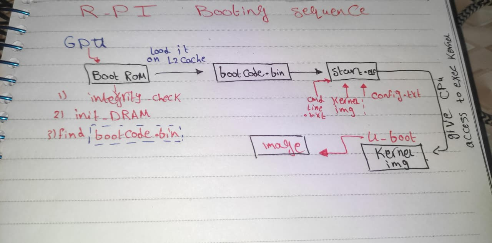
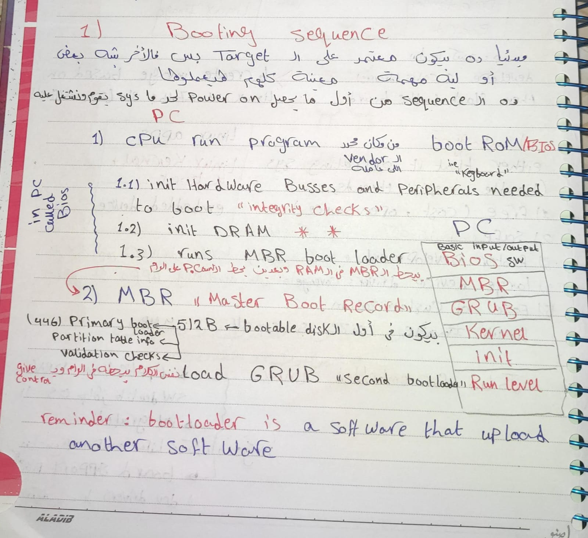
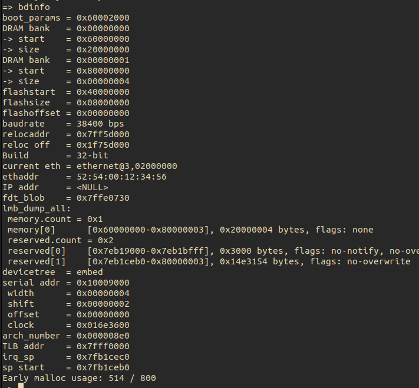
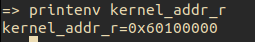
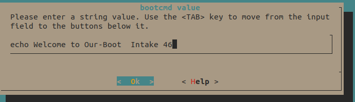

<div align="center">
   <h1>Building and Customizing U-Boot for
    QEMU and Raspberry Pi 3B+</h1>
</div>

---

### Step-by-Step Guide
***1.Build and Test Custom U-Boot in QEMU (Cortex-A9)***

- Clone the U-Boot repository:
```bash
git clone https://github.com/u-boot/u-boot.git
cd u-boot
```
- Build U-Boot for QEMU (Cortex-A9) using vexpress_ca9x4_defconfig:
```bash
make vexpress_ca9x4_defconfig
```
- Set up the environment for cross-compilation (assuming you have the appropriate toolchain installed):
```bash
export CROSS_COMPILE=arm-linux-gnueabi-
make -j
```
- Run U-Boot in QEMU:
```bash
qemu-system-arm -M vexpress-a9 -m 512M -kernel u-boot -nographic -sd virtual_sd_card.img
```
- -M vexpress-a9: Specifies the machine type (Cortex-A9).
- -m 512M: Allocates 512 MB of memory for the virtual machine.
- -kernel u-boot: Specifies the U-Boot binary to load.
- -nographic: Disables graphical output and uses the terminal for input/output.
- -sd virtual_sd_card.img: Specifies the virtual SD card image to use.


---
### Questions And Answers
<details>
<summary><b>1. What is Bootloader?</b></summary>
<ul>
<li>it is a small program that mainly responsible for initializing specific components of the system then run another program (like the kernel) to start the system. </li>
</ul>
</details>

<details>
<summary><b> 2. Raspberry Pi Booting Sequence?</b></summary>
<div align="center">
       
</div>
<ul>
<summary><b>Explanation:</b></summary>
<li>The Raspberry Pi starts the GPU and Goes to BootRom that does some integrity checks. init_DRAM then find bootcode.bin and load it on L2 Cache</li>
<li>bootcode.bin is responsible for loading start.elf</li>
<li>start.elf initializes the system and loads U-Boot.</li>
<li>The kernel initializes the system and starts user-space processes.</li>
</ul>
</details>

<details>
<summary><b> 3. PC Booting Sequence?</b></summary>
<div align="center">
       
</div>
<ul>
<summary><b>Explanation:</b></summary>
<li>CPU runs the <b>BIOS</b> which is responsible for initializing Hardware Busses and peripherals needed , init DRAM , Runs MBR bootloader</li>
<li><b>MBR bootloader</b> Master Boot Record bootloader has partition table inforomation then Loads GRUB</li>
<li><b>GRUB</b> Loads and executes Kernal</li>
<li>The <b>kernel</b> initializes the system and starts user-space processes.</li>
</ul>
</details>

<details>
<summary><b> 4. What is the difference between U-Boot and GRUB?</b></summary>
<ul>
<li><b>U-Boot</b> is a bootloader commonly used in embedded systems, while <b>GRUB</b> is a bootloader commonly used in desktop and server environments.</li>
<li><b>U-Boot</b> is designed to be lightweight and flexible, while <b>GRUB</b> is designed to be feature-rich and support a wide range of operating systems.</li>
</ul>
</details>

<details>
<summary><b> 5. What files must be placed in the Raspberry Pi boot partition to boot U-Boot, and define what is the important of each of them?</b></summary>
<ul>
<li><b>bootcode.bin</b> - This is the first stage bootloader that is    loaded by the GPU. It is responsible for loading the next stage bootloader (start.elf).</li>

<li><b>start.elf</b> - This is the second stage bootloader that is loaded by bootcode.bin. It initializes the system and loads Kernel Based on config.txt.</li>

<li><b>config.txt</b> - This file contains configuration settings for the Raspberry Pi, such as display settings and overclocking options. It is read by start.elf during the boot process.</li>

<li><b>U-Boot</b> - This is the main bootloader that is loaded by start.elf. It initializes hardware and loads the kernel.</li>

<li><b>board.dtb</b> - This is the Device Tree Blob file that describes the hardware configuration of the Raspberry Pi. It is used by the U-Boot to understand the hardware it is running on.</li>
</ul>
</details>


<details>
<summary><b> 6. Which file provides the hardware description to U-Boot on the Raspberry Pi 3B+ and at which stage is it loaded?</b></summary>
<ul>
<li>The <b>board.dtb</b> file provides the hardware description to U-Boot on the Raspberry Pi 3B+.</li>
<li>This file is loaded by U-Boot during the early boot stage, typically after the initial hardware initialization but before loading the kernel.</li>
</ul>
</details>

<details>
<summary><b> 7. After losetup --partscan --show -f sd.img we get devices like /dev/loop5p1 and /dev/loop5p2. Explain how the Linux kernel knows where the partitions start inside the image file.</b></summary>
<ul>
<li>From MBR it has the partition table for the partitioned image file , it has information about the start and end sectors of each partition.</li>
</ul>
</details>

---

### U-Boot Commands Environment
***1- bdinfo .***
<li>Displays information about the board, including the CPU, memory, and other hardware details.</li>

```bash
=> bdinfo
```

<div align="center">
       
</div>


***2.printenv .***
<li>Displays the current environment variables and their values.</li>

<div align="center">
       
</div>


***3- list and load files from partition .***
<li>Lists files in the specified directory on the FAT partition and loads a file into memory.</li>

```bash
=>  ls mmc 0:1 
=>  load mmc 0:1 $addr $filename
```
- mmc refers to the SD card interface.
- 0:1 refers to the first partition on the SD card.
- $addr is the memory address in DRAM where the file will be loaded.
- $filename is the name of the file to be loaded from the FAT partition.

***4- Make the U-Boot banner say “Welcome to Our-Boot – Intake 46” .***
<li>To customize the U-Boot banner, you need to modify the source code of U-Boot Boot options and change modify bootcmd to print the desired message then rebuild.</li>

```bash
=> echo "Welcome to Our-Boot – Intake 46"
```

<div align="center">
       
</div>

***6- Add a custom command hello that prints your name .***
<li>by adding script Variable and Run</li>

```bash
=> setenv helloScript "echo "Hello, My Name is Mustafa Mahgoub";"
=> run helloScript
```


